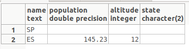
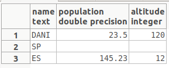

## Entrega Exercici 1- RA1 - Objectes, classes i herència a Postgres

**L'objectiu d'aquest exercici és conèixer i practicar el concepte de classes, objectes i herències en el SGBD Postgres.**

**Per això:**

**Llegir: https://www.postgresql.org/docs/current/static/ddl-inherit.html**

**( assegurar de llegir la documentació en la versió de postgres que vosaltres utilitzeu)**

1. **Seguiu l'exemple explicat: creant la taula Cities i Capitals.  Proveu de fer insercions en ambdues taules i veure els resultats.**

   Script de creacio i eliminacio si existeixen les taules per crearles. 

```sql
DROP TABLE IF EXISTS capitals;
DROP TABLE IF EXISTS cities;

CREATE TABLE cities (
    name            text,
    population      float,
    altitude        int     -- in feet
);

CREATE TABLE capitals (
    state           char(2)
) INHERITS (cities);
```

Insercio de dades a les taules:

```sql
INSERT INTO capitals VALUES('SP');
INSERT INTO cities VALUES('DANI',23.50,120);
INSERT INTO capitals VALUES('ES',145.23,12);
```

Inserto 2 registres a la taula "capitals" i un a la taula "cities".

Mostro les dades de les taules creades anteriorment.

```sql
SELECT * FROM capitals;
```

Tal i com es pot veure en la imatge que ve a continuacio s'han inserit els 2 registres a la taula.



```sql
SELECT * FROM cities;
```

Tal i com es pot veure a la imatge anterior, s'ha insertat el registre que s'ha inserit amb un insert, i apart s'han inserit els 2 registres de la taula que te herencia de aquesta.



2. **Per què creieu que s'utilitza el tableoid ? i el pg_class ?**

*tableoid*

TABLEOID és un valor sencer d'increment automàtic, únic dins d'una base de dades PostgreSQL (no només una taula) que es pot assignar automàticament a cada fila d'una taula. Si un registre s'hereta d'una altra taula com l'instancia d'aquest sera la mateixa tindra el mateix OID.

Tot i que OID es pot utilitzar com a clau primària d’identitat d'una columna(increment automàtic), es recomana utilitzar el tipus de dades SERIAL.

*pg_class*

El catàleg pg_class cataloga les taules i la majoria de totes les altres que tinguin columnes o siguin similars a una taula. Inclou índexs (però també pg_index), seqüències, vistes, tipus compostos i alguns tipus de relació especial; vegeu relkind. A continuació, quan ens referim a tots aquests objectes, parlem de "relacions". No totes les columnes tenen sentit per a tots els tipus de relació.

3. **Al llegir la documentació. Penseu que es pot utilitzar l'herència múltiple en Postgres ? Fiqueu algun exemple**

Si, l'herencia multiple a postgres existeix.

```sql
CREATE TABLE vehicle ( name text );
CREATE TABLE boat () INHERITS (vehicle);
CREATE TABLE car () INHERITS (vehicle);

CREATE TABLE boatcar () INHERITS (boat,car);

INSERT INTO boatcar (name) VALUES ('amphibious car');
```

A totes les columnes antriors, s'haura inserit a la primera fila : 'amphibious car'.

4. **Identifiqueu algunes limitacions de l'herència en Postgres.  Estudieu com es propaguen les foreign keys o els canvis de taules etc..  d'una classe "pare" o superclasse a les seves classes "filles". Podeu  consultar per les instruccions:`SELECT`, `UPDATE`, `DELETE`, `ALTER TABLE`,  `ALTER TABLE ... RENAME, vauum, reindex`).**

La primera limitacio que vec, es que si tu elimines un registre de una superclasse o una classe filla aquest, s'elimina en tots els llocs. I aixo pot ser un problema, ja que si tu vols eliminar un objecte d'una classe filla pero no d'una superclasse aixo no es possible sense canviar el OID. 


https://iessanvicente.com/colaboraciones/postgreSQL.pdf

https://ioc.xtec.cat/materials/FP/Materials/IC_S_INF/INF_IC_S_M02/web/html/media/fp_dam_m02_u8_pdfindex.pdf