## Entrega Exercici 1- RA1 - Objectes, classes i herència a Postgres

**L'objectiu d'aquest exercici és conèixer i practicar el concepte de classes, objectes i herències en el SGBD Postgres.**

**Per això:**

**Llegir: https://www.postgresql.org/docs/current/static/ddl-inherit.html**

**( assegurar de llegir la documentació en la versió de postgres que vosaltres utilitzeu)**

1. **Seguiu l'exemple explicat: creant la taula Cities i Capitals.  Proveu de fer insercions en ambdues taules i veure els resultats.**

   Script de creacio i eliminacio si existeixen les taules per crearles. 

```sql
DROP TABLE IF EXISTS capitals;
DROP TABLE IF EXISTS cities;

CREATE TABLE cities (
    name            text,
    population      float,
    altitude        int     -- in feet
);

CREATE TABLE capitals (
    state           char(2)
) INHERITS (cities);
```

Insercio de dades a les taules:

```sql
INSERT INTO capitals VALUES('SP');
INSERT INTO cities VALUES('DANI',23.50,120);
INSERT INTO capitals VALUES('ES',145.23,12);
```

Inserto 2 registres a la taula "capitals" i un a la taula "cities".

Mostro les dades de les taules creades anteriorment.

```sql
SELECT * FROM capitals;
```

Tal i com es pot veure en la imatge que ve a continuacio s'han inserit els 2 registres a la taula.


```sql
SELECT * FROM cities;
```

Tal i com es pot veure a la imatge anterior, s'ha insertat el registre que s'ha inserit amb un insert, i apart s'han inserit els 2 registres de la taula que te herencia de aquesta.


2. **Per què creieu que s'utilitza el tableoid ? i el pg_class ?**

*tableoid*

TABLEOID és un valor sencer d'increment automàtic, únic dins d'una base de dades PostgreSQL (no només una taula) que es pot assignar automàticament a cada fila d'una taula. Si un registre s'hereta d'una altra taula com l'instancia d'aquest sera la mateixa tindra el mateix OID.

Tot i que OID es pot utilitzar com a clau primària d’identitat d'una columna(increment automàtic), es recomana utilitzar el tipus de dades SERIAL.

*pg_class*

El catàleg pg_class cataloga les taules i la majoria de totes les altres que tinguin columnes o siguin similars a una taula. Inclou índexs (però també pg_index), seqüències, vistes, tipus compostos i alguns tipus de relació especial; vegeu relkind. A continuació, quan ens referim a tots aquests objectes, parlem de "relacions". No totes les columnes tenen sentit per a tots els tipus de relació.

3. **Al llegir la documentació. Penseu que es pot utilitzar l'herència múltiple en Postgres ? Fiqueu algun exemple**

Si, l'herencia multiple a postgres existeix.

```sql
CREATE TABLE vehicle ( name text );
CREATE TABLE boat () INHERITS (vehicle);
CREATE TABLE car () INHERITS (vehicle);

CREATE TABLE boatcar () INHERITS (boat,car);

INSERT INTO boatcar (name) VALUES ('amphibious car');
```

A totes les columnes antriors, s'haura inserit a la primera fila : 'amphibious car'.

4. **Identifiqueu algunes limitacions de l'herència en Postgres.  Estudieu com es propaguen les foreign keys o els canvis de taules etc..  d'una classe "pare" o superclasse a les seves classes "filles". Podeu  consultar per les instruccions:`SELECT`, `UPDATE`, `DELETE`, `ALTER TABLE`,  `ALTER TABLE ... RENAME, vauum, reindex`).**

La primera limitacio que vec, es que si tu elimines un registre de una superclasse o una classe filla aquest, s'elimina en tots els llocs. I aixo pot ser un problema, ja que si tu vols eliminar un objecte d'una classe filla pero no d'una superclasse aixo no es possible sense canviar el OID. 

El suport a orientació a objectes és una simple extensió que ofereix prestacions com l'herència, no un suport complet.

**TAULES:**

```sql
DROP TABLE IF EXISTS estudiant;
DROP TABLE IF EXISTS persona;

CREATE TABLE persona (
    name        text,
    cognom      text,
    edat        int
);

CREATE TABLE estudiant (
    matricula   int
) INHERITS (persona);
```

Creo dues taules:

 - La primera 'persona' te els atributs: nom, cognom i edat.
 - La segona 'estudiant' nomes conte: matricula. Pero com herede de persona tambe conte: nom, cognom i edat.

**INSERTS:**

```sql
INSERT INTO persona VALUES('DANI','BISTUER',23);
```

Inserto dades a la taula pare, i aquests no seran inserits a la taula filla:

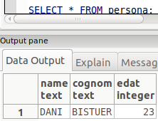

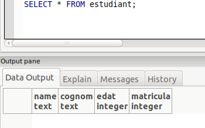


Pero si ho faig a l'inreves i inserto a la taula filla si que s'inserira a la taula pare i els primers camps son els de la taula pare. per tant el insert a la taula filla ha de ser el seguent:

```SQL
INSERT INTO estudiant VALUES('ANTONIO','PADILLA',96,123456);
```


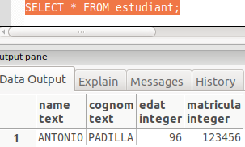

**UPDATE**

Tant com si faig l'UPDATE desde la taula filla com de la taula pare les dades seran modifeicades per les dues .

​	**TAULA FILLA(estudiant)**

```sql
		UPDATE estudiant SET name='HERNESTO' WHERE edat=96;
```

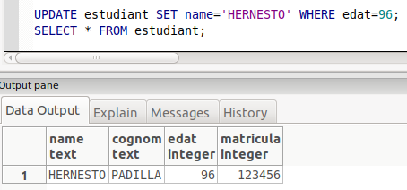

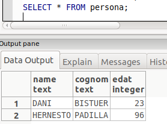

​		Tal i com pots comprovar els canvis han sigut a les dues taules.

​	**TAULA PARE(persona)**

```sql
		UPDATE persona SET name='ALBERT' WHERE edat=96;
```

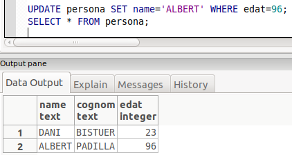

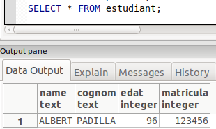

​		Tal i com pots comprovar els canvis han sigut a les dues taules.

**DELETE**

Per a fer el delete insertare mes dades a la taula filla per a tenirlos a les dues dades:

```sql
INSERT INTO estudiant VALUES('PEP','GARCIA',90,123457);
INSERT INTO estudiant VALUES('JOAN','MARIN',80,123453);
```

​	**TAULA FILLA(estudiant)**

```sql
		DELETE FROM estudiant WHERE edat=90;
```

​		Quant l'elimino, aquest s'elimina de la taula pare:

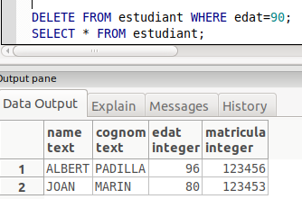

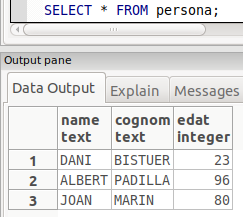

​	**TAULA PARE(persona)**

```sql
		DELETE FROM persona WHERE edat=80;
```

​		Tambe quant l'elimino s'eliminara de la taula filla:

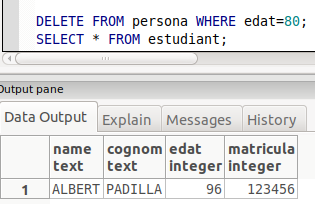

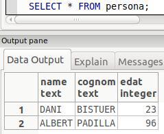

**ALTER TABLE**

​	**TAULA PARE(persona)**

​		Inserare una columna a la taula pare, i aquesta tambe s'insertara a l'estudiat.

```sql
		ALTER TABLE persona ADD COLUMN paisOrigen text;
```

​		Per tant els inserts amb aquesta nova columna inserida serien aixi:

```SQL
		INSERT INTO persona VALUES('VICTOR','DARIAS',70,'XINA');
		INSERT INTO estudiant VALUES('JOAN','MARIN',80,123453,'españa');
```

​	**TAULA FILLA(estudiant)**

​		Al insertar una columna a la taula filla no li passa res a la taula pare perque no hi ha herencia inversa. Simplement la taula estudiant tindra un nou camp.

```sql
		ALTER TABLE estudiant ADD COLUMN descripcio text;
```

 

RENAME

​	ALTER TABLE products RENAME COLUMN product_no TO product_number;

​	taula

​	ALTER TABLE products RENAME TO items;

vauum

​	To clean a single table onek , analyze it for the optimizer and print a detailed vacuum activity report:

​	VACUUM (VERBOSE, ANALYZE) onek;

reindex

To rename an existing index:

ALTER INDEX distributors RENAME TO suppliers;

To move an index to a different tablespace:

ALTER INDEX distributors SET TABLESPACE fasttablespace;

To change an index’s fill factor (assuming that the index method supports it):

ALTER INDEX distributors SET (fillfactor = 75);

REINDEX INDEX distributors;

https://iessanvicente.com/colaboraciones/postgreSQL.pdf

https://ioc.xtec.cat/materials/FP/Materials/IC_S_INF/INF_IC_S_M02/web/html/media/fp_dam_m02_u8_pdfindex.pdf
